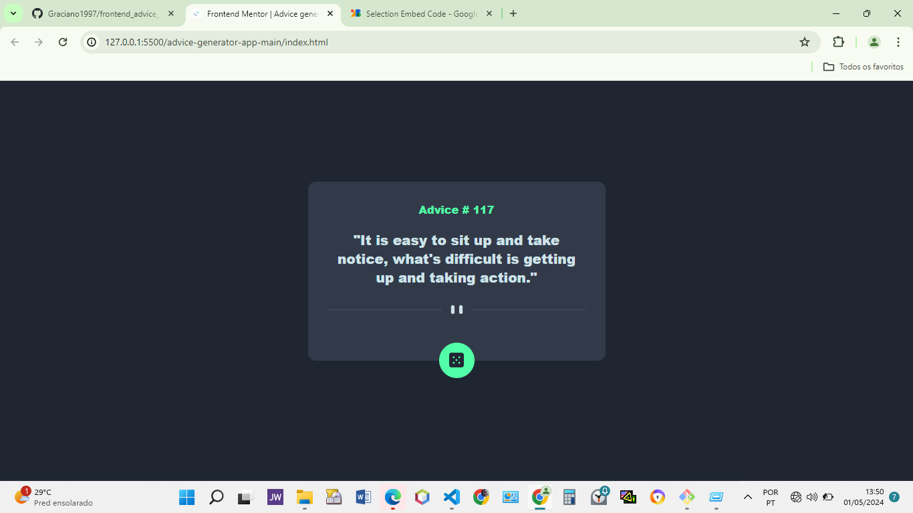
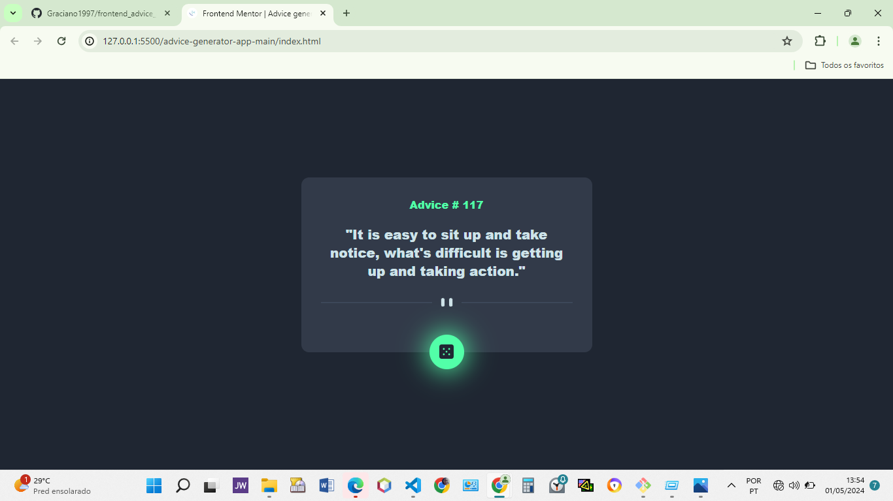
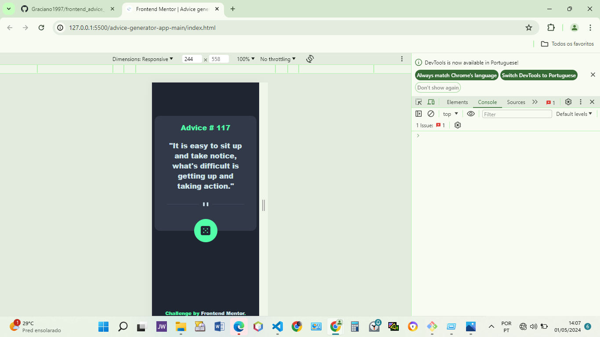

# Frontend Mentor - Advice generator app solution

This is a solution to the [Advice generator app challenge on Frontend Mentor](https://www.frontendmentor.io/challenges/advice-generator-app-QdUG-13db). Frontend Mentor challenges help you improve your coding skills by building realistic projects.

## Table of contents

- [Overview](#overview)
  - [The challenge](#the-challenge)
  - [Screenshot](#screenshot)
  - [Links](#links)
- [My process](#my-process)
  - [Built with](#built-with)
  - [What I learned](#what-i-learned)
  - [Continued development](#continued-development)
  - [Useful resources](#useful-resources)
- [Author](#author)
- [Acknowledgments](#acknowledgments)

## Overview

### The challenge

Users should be able to:

- View the optimal layout for the app depending on their device's screen size
- See hover states for all interactive elements on the page
- Generate a new piece of advice by clicking the dice icon

### Screenshot



### Screenshot-Ative



### Screenshot-Mobile




### Links

- Solution URL: [frontend_advice_generator_Solution_repo]( https://github.com/Graciano1997/frontend_advice_generator.git )
- Live Site URL: [Add live site URL here](https://your-live-site-url.com)

## My process

### Built with

- Semantic HTML5 markup
- CSS custom properties
- Flexbox
- Janilla JS
- Mobile-first workflow

### What I learned

I am sharping my FrontEnd Skills and improve project to project.

```css
.diceContainer:hover {
    box-shadow: 0 0 40px 3px hsl(150, 100%, 66%);
}
```
```js

const quoteGenerator = async () => {
    const response = await fetch('https://api.adviceslip.com/advice');
    const responseObject = await response.json();

    document.querySelector('#quote').textContent = responseObject.slip.advice;
    document.querySelector('#quoteNumber').textContent = responseObject.slip.id;
  }

  const diceButton = document.querySelector('.diceContainer').addEventListener("click", () => {
    quoteGenerator();
});
```

### Continued development

- Improve Sass
- learn others Css Framework


## Author

- Website - [Graciano Henrique Portfolio](https://portofolio-graciano.vercel.app/)
- Frontend Mentor - [@Graciano1997](https://www.frontendmentor.io/profile/Graciano1997)
- Twitter - [@GracianoSoft](https://www.twitter.com/Gracianosoft)

## Acknowledgments

- Microverse
- FrontEnd Mentor